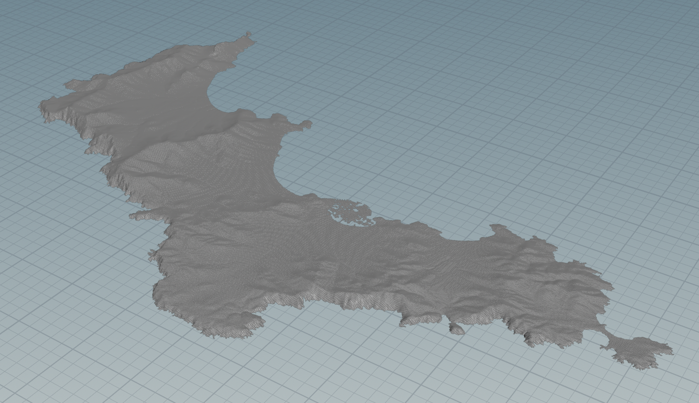
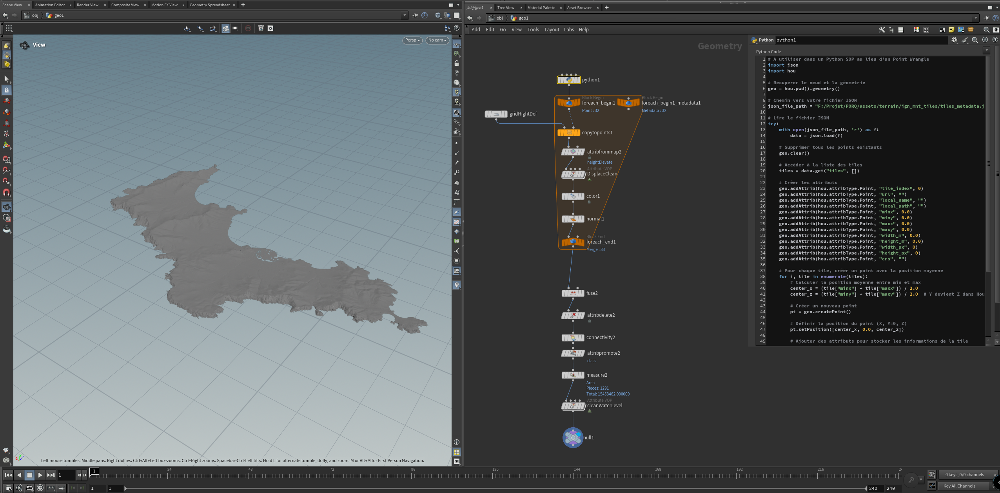
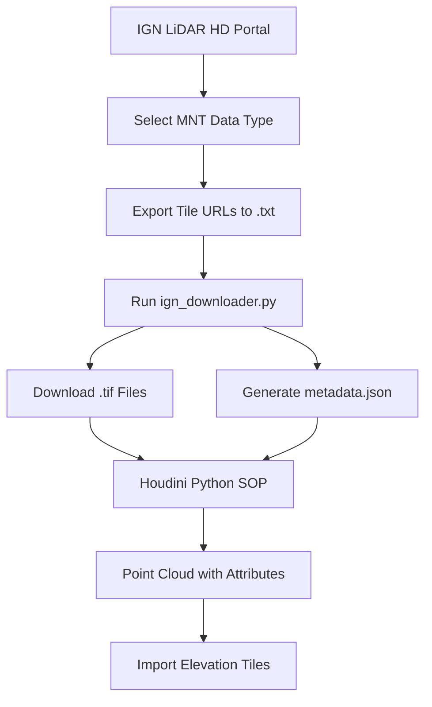

# IGN Elevation Map Importer for Houdini

A professional pipeline tool for importing French IGN (Institut national de l'information géographique et forestière) LiDAR elevation data directly into SideFX Houdini. This tool streamlines the process of downloading elevation tiles and integrating them into Houdini workflows for terrain generation, environmental design, and geographic visualization.


*Final elevation data imported in Houdini*


*Houdini node network setup*

## Features

- **Automated Download**: Download elevation tiles directly from IGN's WMS service
- **Batch Processing**: Handle multiple tiles with automatic retry logic
- **Houdini Integration**: Native Python SOP integration with attribute mapping
- **Metadata Generation**: Complete JSON metadata for tile management
- **Professional Workflow**: Studio-ready pipeline with error handling

## Quick Start

### 1. Select and Download Tile URLs
1. Visit the [IGN LiDAR HD Diffusion Portal](https://diffusion-lidarhd.ign.fr/mnx/)
2. **Important**: Select **MNT** (Digital Terrain Model) from the available options:
   - **MNT** (Modèle Numérique de Terrain) - ✅ **Recommended for terrain workflows**
   - MNS (Modèle Numérique de Surface) - Includes vegetation and buildings
   - MNH (Modèle Numérique de Hauteur) - Height above terrain
3. Select your area of interest and export tile URLs to a `.txt` file
4. Save the file (example: `tile_urls.txt`)

### 2. Download Elevation Data
```bash
python src/ign_downloader.py
```

Configure the downloader by editing the `CONFIG` section in `ign_downloader.py`:
```python
CONFIG = {
    "TXT_SOURCE": "examples/sample_tiles.txt",    # Your tile URLs file
    "DOWNLOAD_DIR": "elevation_data",             # Output directory
    "METADATA_FILE": "tiles_metadata.json",      # Metadata output
}
```

### 3. Import into Houdini
1. Create a new Geometry node
2. Add a Python SOP node
3. Copy the contents of `src/houdini_python.py` into the Python SOP
4. Update the JSON file path in the script
5. Execute the node

## Repository Structure

```
IGN_Elevation_Importer/
├── README.md                           # This file
├── src/
│   ├── ign_downloader.py              # Main download script
│   └── houdini_python.py              # Houdini Python SOP code
├── examples/
│   ├── sample_tiles.txt               # Example tile URLs
│   └── ign_elevationMap_importer.hip  # Demo Houdini scene
├── docs/
│   ├── images/                        # Documentation images
│   └── WORKFLOW.md                    # Detailed workflow guide
└── requirements.txt                   # Python dependencies
```

## Workflow Overview



## Requirements

- Python 3.7+
- SideFX Houdini 19.0+
- Internet connection for downloading tiles

## Installation

1. Clone this repository:
```bash
git clone https://github.com/yourusername/IGN_Elevation_Importer.git
cd IGN_Elevation_Importer
```

2. Install Python dependencies:
```bash
pip install -r requirements.txt
```

3. Configure the downloader paths in `src/ign_downloader.py`

## Configuration

### Download Settings
Edit `CONFIG` in `src/ign_downloader.py`:

| Parameter | Description | Default |
|-----------|-------------|---------|
| `TXT_SOURCE` | Path to tile URLs file | `"sample_tiles.txt"` |
| `DOWNLOAD_DIR` | Output directory for tiles | `"ign_mnt_tiles"` |
| `METADATA_FILE` | JSON metadata filename | `"tiles_metadata.json"` |
| `HTTP_TIMEOUT` | Download timeout (seconds) | `60` |
| `HTTP_RETRIES` | Retry attempts | `2` |

### Houdini Integration
Update the JSON path in `src/houdini_python.py`:
```python
json_file_path = "path/to/your/tiles_metadata.json"
```

## Output Data Structure

The generated JSON contains comprehensive tile metadata:

```json
{
  "tiles": [
    {
      "url": "https://data.geopf.fr/wms-r/...",
      "local_name": "LHD_FXX_0957_6218_MNT_O_0M50_LAMB93_IGN69.tif",
      "local_path": "/absolute/path/to/tile.tif",
      "minx": 956999.75,
      "miny": 6217000.25,
      "maxx": 957999.75,
      "maxy": 6218000.25,
      "width_m": 1000.0,
      "height_m": 1000.0,
      "width_px": 2000,
      "height_px": 2000,
      "crs": "EPSG:2154"
    }
  ],
  "global_bbox": {
    "minx": 956999.75,
    "miny": 6214000.25
  },
  "stats": {
    "total_tiles": 33,
    "successful_downloads": 33,
    "failed_downloads": 0
  }
}
```

## Houdini Attributes

Each point in the generated geometry contains:

| Attribute | Type | Description |
|-----------|------|-------------|
| `tile_index` | Integer | Tile index number |
| `url` | String | Original download URL |
| `local_name` | String | Local filename |
| `local_path` | String | Absolute file path |
| `minx`, `miny`, `maxx`, `maxy` | Float | Bounding box coordinates |
| `width_m`, `height_m` | Float | Tile dimensions in meters |
| `width_px`, `height_px` | Integer | Tile dimensions in pixels |
| `crs` | String | Coordinate reference system |

## Advanced Usage

### Batch Processing Multiple Regions
```bash
# Process multiple tile sets
python src/ign_downloader.py --config region1_config.py
python src/ign_downloader.py --config region2_config.py
```

### Custom Coordinate Systems
The tool supports various CRS formats. Ensure your tile URLs specify the correct CRS parameter (default: EPSG:2154 - Lambert-93).

## Troubleshooting

### Common Issues

**Download Failures**: Check internet connection and IGN service availability
```bash
# Test connectivity
curl -I "https://data.geopf.fr/wms-r/"
```

**Houdini Import Errors**: Verify JSON file path and format
```python
# Validate JSON in Python
import json
with open("tiles_metadata.json", "r") as f:
    data = json.load(f)
    print(f"Loaded {len(data['tiles'])} tiles")
```

**Memory Issues**: For large datasets, consider processing tiles in batches

## Contributing

1. Fork the repository
2. Create a feature branch (`git checkout -b feature/enhancement`)
3. Commit changes (`git commit -am 'Add enhancement'`)
4. Push to branch (`git push origin feature/enhancement`)
5. Create Pull Request

## License

This project is licensed under the MIT License - see the [LICENSE](LICENSE) file for details.

## Acknowledgments

- IGN (Institut national de l'information géographique et forestière) for providing open elevation data
- SideFX for Houdini's excellent Python integration
- The open-source geospatial community

## Contact

For professional support and studio integration, please contact [your-email@domain.com]

---

*This tool is designed for professional VFX and game development workflows. Not affiliated with IGN or SideFX.*
test